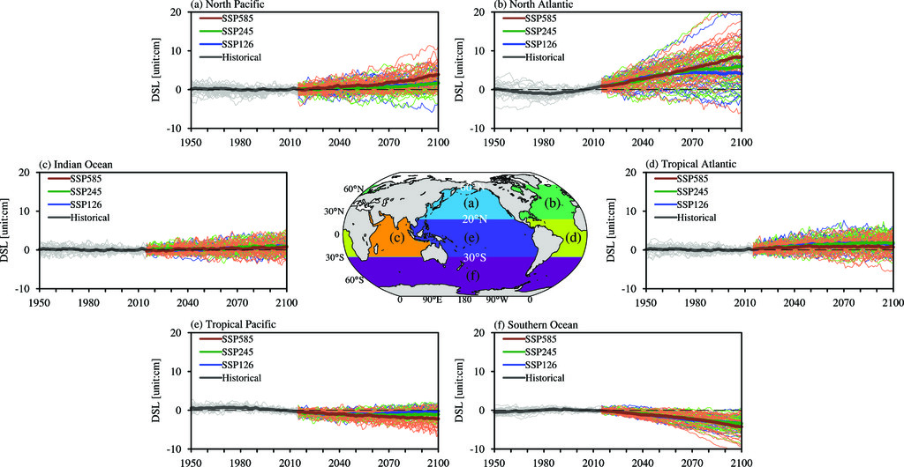

# Defining Region of Common Variability

A common method is to just average over the basin-wide region. Can we expect the same variability within these regions?

*This figure from Jin et al. (2024) is one example for defining regions of common sea level variability by averaging over basin-wide areas. It compares dynamic sea level (DSL) anomalies from historical and future projections under different Shared Socioeconomic Pathway (SSP) scenarios (SSP126, SSP245, SSP585) across six major ocean basins: the North Pacific, North Atlantic, Indian Ocean, tropical Atlantic, tropical Pacific, and Southern Ocean. Thin lines represent individual models, and thick lines represent the multimodel mean.*
