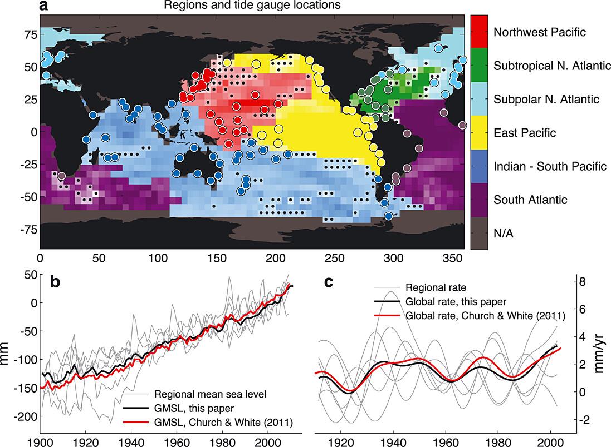
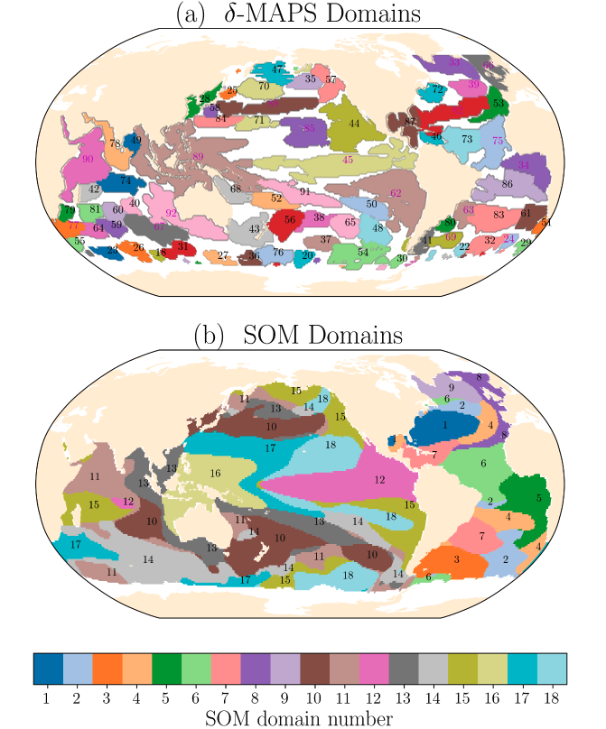

# Defining Region of Common Variability

A common method is to just average over the basin-wide region. Can we expect the same variability within these regions?

*This figure from Jin et al. (2024) is one example for defining regions of common sea level variability by averaging over basin-wide areas. It compares dynamic sea level (DSL) anomalies from historical and future projections under different Shared Socioeconomic Pathway (SSP) scenarios (SSP126, SSP245, SSP585) across six major ocean basins: the North Pacific, North Atlantic, Indian Ocean, tropical Atlantic, tropical Pacific, and Southern Ocean. Thin lines represent individual models, and thick lines represent the multimodel mean.*

Thompson and Merrifield (2014) define six basin-scale ocean regions based on the coherence and phase of satellite-derived sea surface height (SSH) anomalies. These regions are objectively identified using agglomerative hierarchical cluster analysis (AHCA), which groups observations by minimizing a defined measure of "distance" between them, taking into account both spatial proximity and temporal correlation.

The geometries of the northernmost regions are linked to well-known dynamical structures like the Pacific Decadal Oscillation and the gyres in the North Atlantic. In contrast, the southern regions are not as clearly aligned with such features but exhibit the most robust coherence at interannual and longer timescales.

*Objectively defined ocean regions and the tide gauge locations averaged within each region. The color saturation of each cell reflects the relationship of each cell to the other cells in its region. Cells in which the relationship is not significant at the 95% level are marked with small black circles. (b) Regional mean sea level in each region and GMSL from Church and White [2011] and the area‐weighted average of the regional time series. (c) Twenty year rates of change in regional sea level, the area‐weighted average of the regional rates, and rates from Church and White [2011].*

Camargo et al. (2023) employed two machine learning techniques to define domains based on coherent temporal sea-level variability: a neural network approach (self-organizing map, SOM) and a network detection approach (δ-MAPS). Both methods are unsupervised machine learning approaches designed to detect patterns in high-dimensional data by reducing it to lower-dimensional representations. The SOM method does not require domains to be contiguous and can identify connections between geographically distant regions, while δ-MAPS ensures spatial continuity within the domains.

*Domains of coherent sea-level variability: (a) δ-MAPS method (92 domains) and (b) self-organizing map (SOM) method (18 domains). Numbers indicate the domain code. δ-MAPS domains with codes in magenta indicate selected domains for Fig. 4. For visibility, small domains have not been labelled. Given the large number of domains, δ-MAPS has a repeating colour pallet, but since δ-MAPS domains need to be continuous, repeated colours do not indicate the same domain. White regions in δ-MAPS indicate incoherent regions, which were not incorporated in any domain.*
